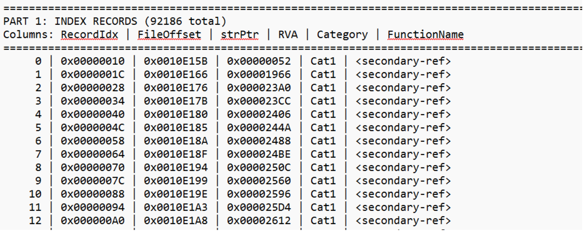
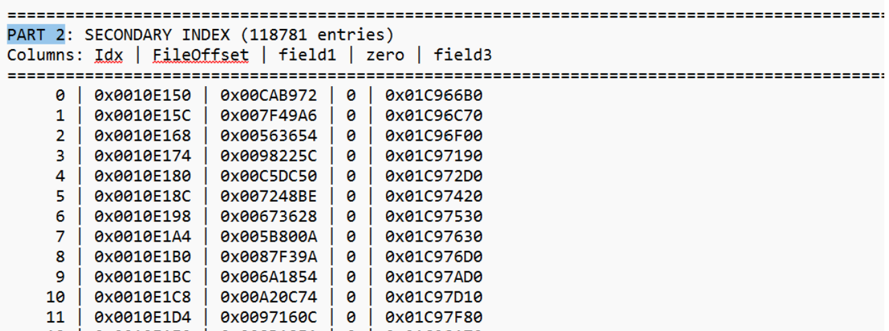
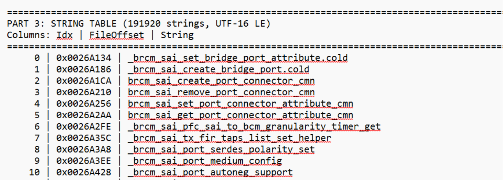

# Azure Profiler Device-Level Performance Analysis

1. [1. Overview](#1-overview)
2. [2. Architecture Overview](#2-architecture-overview)
3. [3. Azure Profiler Container Design](#3-azure-profiler-container-design)
   1. [3.1. Why use a container](#31-why-use-a-container)
   2. [3.2. Container responsibilities](#32-container-responsibilities)
4. [4. Usage](#4-usage)
   1. [4.1. Prerequisites](#41-prerequisites)
   2. [4.2. Container Configuration](#42-container-configuration)
   3. [4.3. Running Azure Profiler](#43-running-azure-profiler)
   4. [4.4. Verifying the Profiler is Running](#44-verifying-the-profiler-is-running)
5. [5. Integration with SONiC Test Framework](#5-integration-with-sonic-test-framework)
   1. [5.1. Overview](#51-overview)
   2. [5.2. Prerequisites](#52-prerequisites)
   3. [5.3. Enabling Profiling](#53-enabling-profiling)
   4. [5.4. Behavior](#54-behavior)
6. [6. Observing and Analyzing Profiling Data](#6-observing-and-analyzing-profiling-data)
7. [Appendix: Structure of the .debug.sym File](#appendix-structure-of-the-debugsym-file)
   1. [6.1. Data collection and aggregation](#61-data-collection-and-aggregation)
   2. [6.2. Visualization](#62-visualization)
   3. [6.3. Querying via Kusto](#63-querying-via-kusto)
   4. [6.4. Symbol Resolution](#64-symbol-resolution)

## 1. Overview

To better understand device-level performance behavior, such as how messages are processed across different threads or services, and where performance hotspots or bottlenecks occur, we aim to build a profiling dashboard that visualizes CPU execution paths in a perf flame graph-like format.

Traditional perf-based profiling often depends on language- or runtime-specific support, which may not be available in all environments. To address this limitation, we require an alternative approach that does not rely on application-level instrumentation.

After evaluation, we adopt [Azure Profiler](https://eng.ms/docs/products/azure-profiler/home/azure-profiler) as the profiling solution. Azure Profiler provides insights into what's running on machines during both normal execution and abnormal or trigger-based scenarios. It is a distributed sampling profiler designed for low-impact profiling in production environments, using a statistical approach to analyze service behavior.

The centralized backend service aggregates profiling data on a daily basis, provides built-in performance insights, publishes data to Kusto, and supports direct integration for further analysis and visualization.

## 2. Architecture Overview

The profiling solution consists of the following components:

+ Target machine / device \
  The physical or virtual machine where performance analysis is required.

+ Azure Profiler container \
  A dedicated docker container running Azure Profiler, responsible for collecting CPU samples from the host system.

+ Azure Profiler backend \
  A centralized service that aggregates, processes, and stores profiling data.

+ Visualization & analysis layer \
  Profiling data can be queried from Kusto and visualized in flame graph-like views to identify hotspots and bottlenecks.

```
+--------------------------------------+
|      Target Machine / Device         |
|                                      |
|  +--------------------------------+  |
|  |  Host OS (Processes / Threads) |  |
|  +---------------+----------------+  |
|                  | CPU sampling       |
|  +---------------v----------------+  |
|  |  Azure Profiler Container      |  |
|  |          (Docker)              |  |
|  +--------------------------------+  |
+------------------+-------------------+
                   |
                   | Upload blobs (HTTPS)
                   v
        +---------------------+
        |  Azure Profiler     |
        |      Backend        |
        +----------+----------+
                   |
                   | Aggregate & publish
                   v
        +---------------------+
        |      Kusto DB       |
        +----------+----------+
                   |
                   | ViewerUrl
                   v
        +---------------------+
        |  Flame Graph Viewer |
        +---------------------+
```

## 3. Azure Profiler Container Design

To ensure isolation, portability, and ease of deployment, Azure Profiler is executed inside a dedicated docker container.

### 3.1 Why use a container

+ Avoids polluting the host system with additional dependencies.
+ Provides a consistent runtime environment across different machines.
+ Simplifies deployment and lifecycle management.

### 3.2 Container responsibilities

The Azure Profiler container is responsible for:
+ Bundling all required runtime dependencies in the image so the host does not need to install anything.
+ Running the Azure Profiler binary.
+ Collecting CPU execution samples from the host.
+ Uploading profiling data to the Azure Profiler backend.

## 4. Usage

### 4.1 Prerequisites

Before deploying the Azure Profiler container, ensure the following conditions are met on the target device:
+ Docker is installed and running.
+ The device has network access to the Azure Profiler backend (HTTP/HTTPS outbound).
+ If the device is behind a proxy, configure the proxy environment variables accordingly.

### 4.2 Container Configuration

The Azure Profiler container accepts the following parameters when launched:

| Parameter | Description | Example |
|---|---|---|
| `GroupName` | Logical group name for grouping profiling data in the backend | `SonicTest` |
| `Role` | Role identifier for the device or service being profiled | `TestRole` |
| `IntervalMinutes` | Profiling interval in minutes. Set to `0` for continuous profiling | `0` |

If the device requires a proxy to reach the backend, set the following environment variables before running the container:

```bash
export https_proxy=http://<proxy_host>:<proxy_port>
export http_proxy=http://<proxy_host>:<proxy_port>
```

### 4.3 Running Azure Profiler

Start (or restart) the profiler service using systemd:

```bash
sudo systemctl restart profiler
```

The service is managed via supervisord inside the container, which automatically invokes the Azure Profiler binary with the parameters configured in Section 4.2. Internally, the binary is called as:

```bash
./AzureProfiler /GroupName:<GroupName> /Role:<Role> /IntervalMinutes:<IntervalMinutes>
```

> **Note:** The command above is executed by supervisord inside the container. Update `GroupName`, `Role`, and `IntervalMinutes` in the profiler configuration before starting the service.

### 4.4 Verifying the Profiler is Running

Check the syslog for AzureProfiler output:
```bash
sudo grep AzureProfiler /var/log/syslog
```
A successful profiling run will produce output similar to the following:
```text
2026 Feb  3 07:45:59.710414 str3-8102-01 NOTICE AzureProfiler: Profiling...
2026 Feb  3 07:46:24.310178 str3-8102-01 NOTICE AzureProfiler: Uploaded Blob: 2E3F7591A9FEDFB5735D7A733884B645.bin
2026 Feb  3 07:46:24.316768 str3-8102-01 NOTICE AzureProfiler: Child process 562488 exited, status=0
```

## 5. Integration with SONiC Test Framework

### 5.1 Overview

A pytest plugin `azure_profiler` has been integrated into the SONiC test framework (`tests/common/plugins/azure_profiler`). It is automatically loaded for all tests and supports two modes to enable profiling during test execution:

- **Global mode**: enables profiling for every test case in the run
- **Per-test mode**: enables profiling for specific test cases only

### 5.2 Prerequisites

Before using the plugin, ensure the `profiler` container is deployed and running on the target DUT (see [Section 4](#4-usage)).

### 5.3 Enabling Profiling

**Option 1: Enable for all tests**

Pass `--with_azure_profiler` when running tests:

```bash
./run_tests.sh ... -e --with_azure_profiler
```

**Option 2: Enable for a specific test only**

Add the `@pytest.mark.azure_profiler` decorator to the test function:

```python
@pytest.mark.azure_profiler
def test_something(duthost):
    ...
```

### 5.4 Behavior

When enabled, the plugin performs the following steps around each test:

1. **Setup**: Verifies the `profiler` container exists on the DUT, then starts `AzureProfiler` inside it in the background.
2. **During test**: AzureProfiler continuously samples CPU execution stacks while the test runs.
3. **Teardown**: After the test completes, waits up to 100 seconds for AzureProfiler to finish uploading profiling data to the backend before proceeding.

> **Note:** The profiler is best-effort. If it fails to start (e.g., container not found, proxy misconfigured), the test proceeds normally with a warning logged.

## 6. Observing and Analyzing Profiling Data

### 6.1 Data collection and aggregation

+ Azure Profiler continuously samples CPU execution stacks during runtime.
+ Samples are uploaded to the centralized backend service.
+ Profiling data is aggregated per machine, per role, and per day.

### 6.2 Visualization

+ Profiling results can be visualized as flame graph-like CPU execution paths.
+ Hot functions, services, or threads appear as wider blocks, indicating higher CPU consumption.
+ This helps identify:
  + Performance hotspots
  + CPU-intensive services or threads
  + Unexpected execution paths

### 6.3 Querying via Kusto

+ Profiling data is published to Kusto. Query the `Identifiers` table and open the `ViewerUrl` field to view the flame graph:
```kusto
cluster('azureprofilerfollower.westus2.kusto.windows.net').database('azureprofiler').Identifiers
| where Topic contains "<your-GroupName>"
```
+ Replace `<your-GroupName>` with the `GroupName` value configured in Section 4.2 (e.g., `SonicTest`).
+ The `ViewerUrl` column in the results contains a download link for the Azure Profiler Viewer. Open the Viewer, then select the target date and `GroupName` to load the corresponding profiling data and view the flame graph.

### 6.4 Symbol Resolution

To display human-readable function names in the flame graph, configure the Azure Profiler Viewer to use the symbol server.

**Workflow:**
1. The Azure Profiler container collects CPU samples and generates `.debug` symbol files on the device.
2. A pipeline step converts each `.debug` file into the `.debug.sym` format consumed by the Azure Profiler Viewer. The conversion uses the `AzureProfiler.ConvertSymbolsInDirectory` API shipped inside Azure Profiler Viewer's `AzureProfiler.Managed.dll` — the same code path the Viewer's "Convert Symbols" UI invokes.
3. The `.debug.sym` files are uploaded to the Azure DevOps Artifacts Symbol Server (for the internal upload pipeline reference, see [Azure Profiler — Symbols](https://eng.ms/docs/products/azure-profiler/viewing-data/scenarios/symbols)):
   - Organization: `msazure`
   - Symbol Server URL: `https://artifacts.dev.azure.com/msazure/_apis/symbol/symsrv`
4. Configure the Azure Profiler Viewer with the following symbol path:
```buildoutcfg
  srvC:\SymbolCache*https://artifacts.dev.azure.com/msazure/_apis/symbol/symsrv
```
  Authentication: leave the username blank and use a PAT with **Symbols (Read)** scope as the password.
## Appendix: Structure of the .debug.sym File

The `.debug.sym` file is a binary format used by the Azure Profiler symbol pipeline to resolve raw addresses into human-readable function names. It consists of three sequential parts:

### Part 1: Index Records

The core lookup table. Each record represents one function and provides the mapping from a memory address to a function name.

- **Cat1 records**: contain a `strPtr` that points into the Secondary Index (Part 2) as an indirect reference.
- **Cat2 records**: contain a `strPtr` that points directly into the String Table (Part 3).

> In short: the address → function name mapping table.



### Part 2: Secondary Index

An indirect lookup layer referenced by Cat1 records. Each entry contains a `field3` value that holds a virtual address, which is only valid at runtime and cannot be resolved from the static file alone.

> In short: a runtime indirection layer for fast lookup; incomplete in static form.



### Part 3: String Table

Stores all function name strings encoded as UTF-16 LE, each terminated by a 2-byte null (`\x00\x00`). Cat2 records' `strPtr` values point directly to an offset within this region.

> In short: the string pool for all function names.


